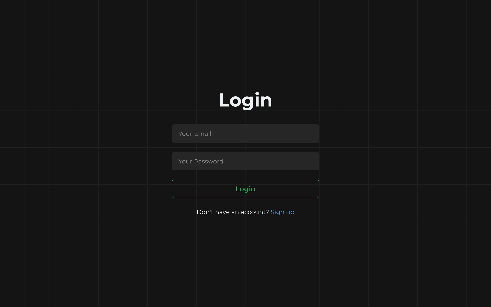

# 💲 Fynlog – your personal finance tracker

Fynlog is a modern full-stack finance tracking app that helps users log expenses, set category-wise budgets, and visualize spending. Built with a focus on clean UI, performance, and a structured backend API.

## ✨ Features

- 📊 **Transaction Logging** – Add, view, and delete your income/expenses.
- 📁 **Category Management** – Pre-defined categories with emoji support.
- 🎯 **Budget Tracking** – Set and manage budgets for each category.
- 📅 **Monthly Insights** – Track how much you’ve spent each month per category.
- 🧾 **Transaction Details Modal** – View details in a quick modal interface.
- 🔐 **Authentication** – Secure signup and login (JWT-based).
- 🌐 **Responsive UI** – Fully responsive design across devices.
  

## 🛠️ Tech Stack

### 🧩 Frontend
- **React** with **TypeScript**
- **Vite** for fast build and dev server
- **Zustand** for state management
- **Tailwind CSS** for styling
- **React-Twemoji** for emoji rendering
- **Lucide-react** for icons

### ⚙️ Backend
- **Node.js** + **Express** with **TypeScript**
- **PostgreSQL** as the database
- **Sequelize ORM**
- **JWT** for authentication
- **Cookie-parser** for session handling
- **CORS**, **dotenv** for configuration

# ⚙️ Setup Guide — Finance Tracker

Follow these quick steps to run the project locally.

## 1. Clone the repository

```bash
git clone https://github.com/1sh-repalto/finance-tracker.git
cd finance-tracker
```

## 2. Backend Setup

```bash
cd backend
npm install
```

### Create a .env in your backend. Check the .env.example inside /backend for .env structure

### run backend

```bash
npm run dev
```

# 3. Fronent Setup

```bash
cd ../frontend
npm install
```

### Create a .env in your frontend. Check the .env.example inside /frontend for .env structure

### run frontend

```bash
npm run dev
```
### ✅ Setup complete

## 📸 Screenshots

### 🔐 Authentication

  
*User login screen with email & password.*

### 📊 Dashboard Overview

  
*Dashboard showing total balance, charts, and recent activity.*

### ➕ Add Transaction

  
*Modal to quickly add a new income or expense.*

### 📁 Budgets

  
*Set monthly limits for categories and track spending progress.*

### 📄 Transactions List

  
*View all your transactions with pagination and filters.*


## 📁 Project Structure Overview

### Root Directory
- backend
- frontend
- Documentation (`README.md`)

### `backend/`
Handles server-side logic, including:
- API route handling
- Authentication and authorization
- Database models and configuration
- Middleware for request validation and error handling
- Utility functions and helpers

### `frontend/`
Manages the user interface and experience, containing:
- Pages for different app views (Dashboard, Transactions, Budgets, etc.)
- Reusable UI components
- State management logic
- API communication hooks and utility functions


## API Endpoints

### 🔐 Auth
- `POST /api/auth/login` – Login user
- `POST /api/auth/signup` – Register new user
- `GET /api/auth/validate` – Validate session (requires auth)
- `POST /api/auth/refresh` – Refresh access token
- `POST /api/auth/logout` – Logout user
- `GET /api/auth/session-status` – Check session status

### 💰 Budgets
- `POST /api/budgets/` – Create a new budget (requires auth)
- `GET /api/budgets/` – Fetch budgets for the current month (requires auth)
- `DELETE /api/budgets/:id` – Delete a specific budget (requires auth)

### 💸 Transactions
- `POST /api/transactions/` – Create a new transaction (requires auth)
- `GET /api/transactions/all` – Fetch all transactions (requires auth)
- `GET /api/transactions/monthly` – Get monthly transactions summary (requires auth)
- `GET /api/transactions/paginated` – Paginated transactions list (requires auth)
- `DELETE /api/transactions/:id` – Delete a transaction (requires auth)

### 👤 Users
- `GET /api/users/` – Get all users (requires auth)
- `DELETE /api/users/:id` – Delete a user by ID (requires auth)

